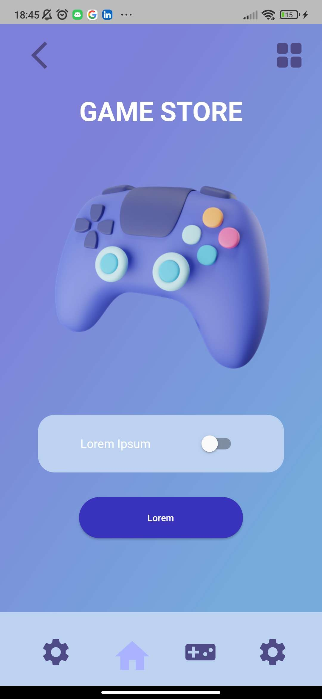
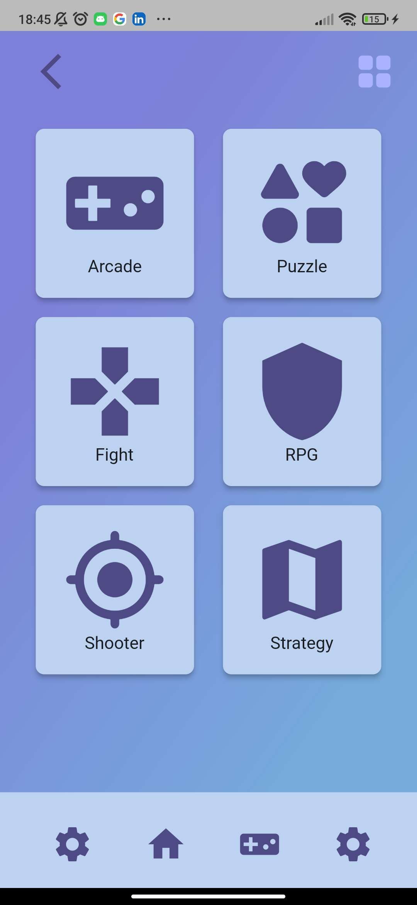
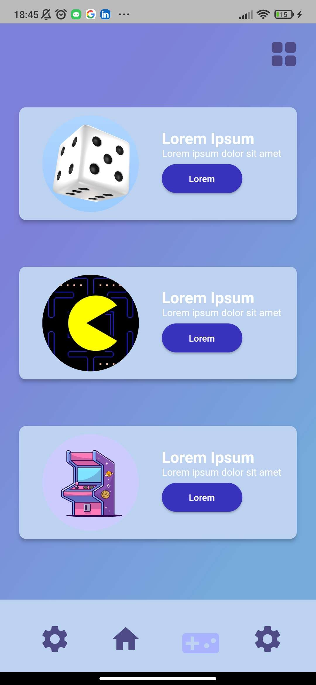

# Loja de Jogos para Celular

Este é um aplicativo Flutter que simula a interface de uma loja de jogos para dispositivos móveis. Ele foi desenvolvido com fins de aprendizado e demonstração.

<table>
  <tr>
    <td><</td>
    <td></td>
    <td></td>
  </tr>
</table>

## Funcionalidades

- Apresenta uma lista de jogos disponíveis para compra.
- Permite aos usuários visualizar detalhes de cada jogo, incluindo nome, preço e descrição.
- Pode ser facilmente personalizado para adicionar mais jogos e funcionalidades.

## Pré-requisitos

- Flutter SDK instalado e configurado no seu ambiente de desenvolvimento.
